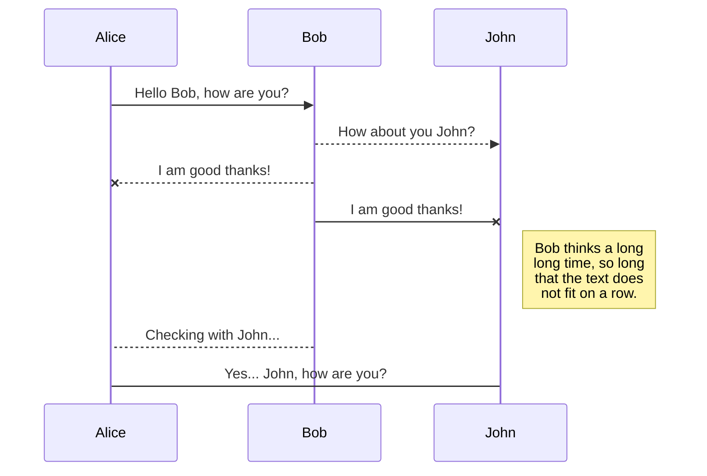
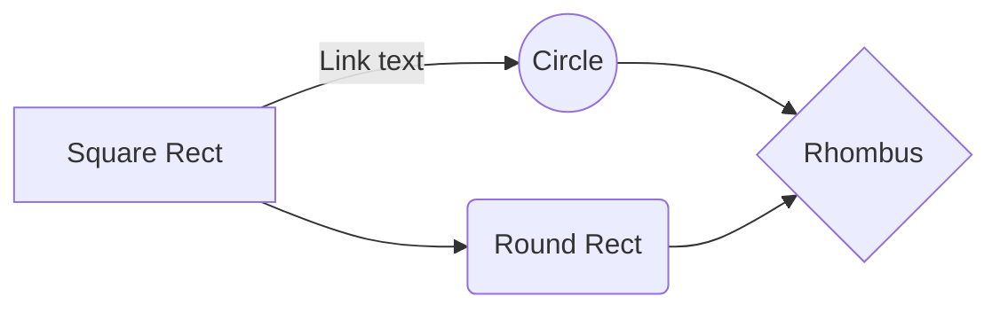

# ejemplo-doc

The beginning of an awesome article...
lcxvcxc

vcx
```json
private readonly string _tokenEndPoint = "https://login.wolterskluwer.eu/auth/core/connect/token";
private readonly string _oauthClientName = "WK.ES.A3WebApi.A23456"; 
private readonly string _oauthClientSecret = "v4zJAEZe6CtYUcqD";
private readonly string _redirectUri = "http://localhost:53971/CallbackFromWKA";

public async Task ProcessAuthorizationCodeAsync(string code)
{

    using (var httpClient = new HttpClient() { BaseAddress = new Uri(_tokenEndPoint) })
    {

        var httpRequest = new HttpRequestMessage(HttpMethod.Post, "");
        var parameters = new Dictionary();

        parameters.Add("grant_type", "authorization_code");
        parameters.Add("client_id", _oauthClientName);
        parameters.Add("client_secret", _oauthClientSecret);
        parameters.Add("redirect_uri", _redirectUri);
        parameters.Add("code", code);

        httpRequest.Content = new FormUrlEncodedContent(parameters);

        var httpResponse = await httpClient.SendAsync(httpRequest);

        if (!httpResponse.IsSuccessStatusCode)
        {
            return null;
        }

        var content = await httpResponse.Content.ReadAsStringAsync();

        return JsonConvert.DeserializeObject(content);

    }

}

```

## UML diagrams

You can render UML diagrams using [Mermaid](https://mermaidjs.github.io/). For example, this will produce a sequence diagram:



And this will produce a flow chart:


